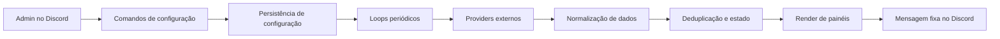
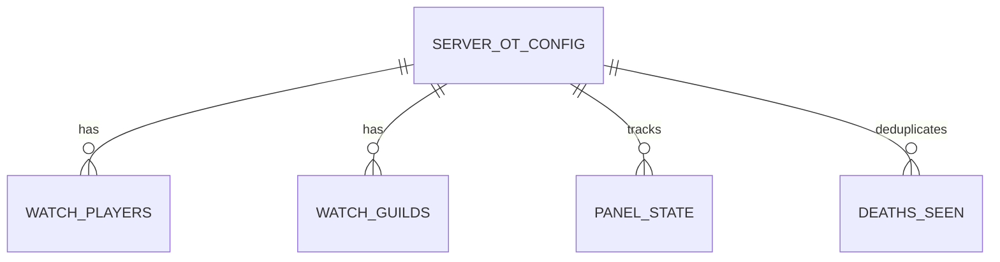

# Diagramas

## Fluxo principal

```mermaid
flowchart LR
    A[Admin no Discord] --> B[Comandos de configuração]
    B --> C[Persistência de configuração]
    C --> D[Loops periódicos]
    D --> E[Providers externos]
    E --> F[Normalização de dados]
    F --> G[Deduplicação e estado]
    G --> H[Render de painéis]
    H --> I[Mensagem fixa no Discord]
```

## Modelo conceitual

```mermaid
erDiagram
    SERVER_OT_CONFIG ||--o{ WATCH_PLAYERS : has
    SERVER_OT_CONFIG ||--o{ WATCH_GUILDS : has
    SERVER_OT_CONFIG ||--o{ PANEL_STATE : tracks
    SERVER_OT_CONFIG ||--o{ DEATHS_SEEN : deduplicates
```
